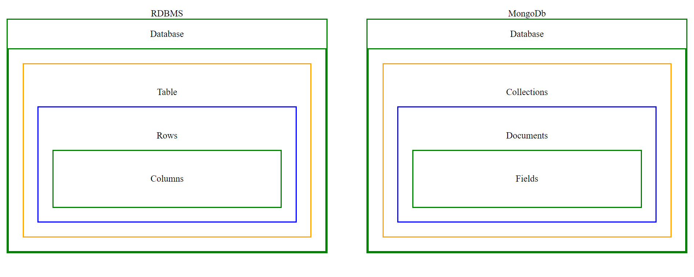

`5-0:` [Introduction](#5-0-introduction)

`5-1-A:` [Install MongoDB compass and No SQL Booster Windows](#5-1-a-install-mongodb-compass-and-no-sql-booster-windows)

`5-1-B:` [Install MongoDB compass and No SQL Booster Max Linux](#5-1-b-install-mongodb-compass-and-no-sql-booster-mac-linux)

`5-2:` [Insert, InsertOne, find, findOne, field, filtering, project](#5-2-insert-insertone-find-findone-field-filtering-project)

`5-3:` [$eq, $neq, $gt, $gte, $lte](#5-3-eq-neq-gt-gte-lte)

`5-4:` [$in, $nin, implicit and condition](#5-4-in-nin-implicit-and-condition)

`5-5:` [$and, $or, implicit vs explicit](#5-5-and-or-implicit-vs-explicit)

`5-6:` [$exists, $type, $size](#5-6-exists-type-size)

`5-7:` [$all, $elemMatch](#5-7-all-elemmatch)

`5-8:` [$set, $addToSet, $push](#5-8-set-addtoset-push)

`5-9:` [$unset, $pop, $pull, $pullAll](#5-9-unset-pop-pull-pullall)

`5-10:` [ More about $set, how to explore documentation](#5-10-more-about-set-how-to-explore-documentation)

`5-11:` [delete documents, drop collection and how to explore by yoursef](#5-11-delete-documents-drop-collection-and-how-to-explore-by-yoursef)

`5-12:` [Practice task-1](#5-12-practice-task-1)

`5-13:` [Database Command List](#5-13-database-command-list)

`5-14:` [Mongodb Shell Setup](#5-14-mongodb-shell-setup)

## 5-0 Introduction

#### What we are going to learn ?

- Mongodb basic query
- Powerful Aggregation Framework
- Indexing for faster queries
- Express.js and it's core concept
- Mongoose Fundamentals
- Crud operation using Express, Mongoose and Typescript
- Assignment 2

#### What is `Mongodb`

- Mongodb is a NoSql database which helps us to store data in a JSON like format
- NoSql database break form traditional relational model
- Ideal for managing vast data.
- Mongodb stands out for its
  - scalibility
  - flxibility
  - performance
- Users include google, facebook, eBay etc.
- Big company use mongdb for their micro services

#### Why should we use MongoDb

- Scalable high-performance and open source.
- Document-oriented Database
- Cost-Effective solutions.
- Rich Ecosystem of Tools, Documentation and Community.
- In Traditional database you must follow schema
- But in Mongodb you can have felxibility
- You can put structure data in mongodb and if you wish you can put unstructured data in mongodb

<table>
    <tr>
        <th>Feature</th>
        <th>Mongodb</th>
        <th>Traditional Database</th>
    </tr>
    <tr>
        <td>Data Model</td>
        <td>Document-oriented</td>
        <td>Relational</td>
    </tr>
    <tr>
        <td>Schema</td>
        <td>Flexible</td>
        <td>Rigid</td>
    </td>
    <tr>
       <td>Scalability</td>
        <td>Horizontal and vertical</td>
        <td>Vertical</td>
    </tr>
    <tr>
     <td>Performance</td>
        <td>Optimized for unstructured or semi-structured data</td>
        <td>Optimized for sturctured quries</td>
    </tr>
    
</table>

---

    

---

- In simple terms
<table>
    <tr>
        <th>RDBMS</th>
        <th></th>
        <th>MongoDB</th>
    </tr>
    <tr>
        <td>Database</td>
        <td>>-- are called in mongodb -></td>
        <td>Database</td>
    </tr>
    <tr>
        <td>Tables</td>
         <td>>-- are called in mongodb -></td>
        <td>Collectins</td>
    </tr>
     <tr>
        <td>Rows</td>
         <td>>-- are called in mongodb -></td>
        <td>Documents</td>
    </tr>
    <tr>
        <td>Columns</td>
         <td>>-- are called in mongodb -></td>
        <td>Fields</td>
    </tr>
</table>

---

### Extra features of MongoDb

- Json-like Document (BSON)
- Indexing
- Aggregation Framework
- Security Features
- Free Atlas Database
- Mongodb Compass (GUI-> graphical user interface)

### Where Mongodb will be a good choice

- E-commerce applications
- Social media applications
- Gamming applications
- Web applications
- Mobile applicatins
- Real-time applications

## 5-1-A Install MongoDB compass and No SQL Booster Windows

## 5-1-B Install MongoDB compass and No SQL Booster Mac Linux

## 5-2 insert insertOne find findOne field filtering project

## 5-3 $eq $neq $gt $gte $lte

## 5-4 $in, $nin, implicit and condition

## 5-5 $and $or implicit-vs-explicit

## 5-6 $exists, $type, $size

## 5-7 $all $elemMatch

## 5-8 $set $addToSet $push

## 5-9 $unset $pop $pull $pullall

## 5-10 More about $set, how to explore documentation

## 5-11 delete documents, drop collection and how to explore by yoursef

## 5-12 Practice task-1

## 5-13 Database Command List

<table>
    <tr>
        <th>
            Purpose 
        </th>
        <th>
            Command
        </th>
    </tr>
    <tr>
        <td>
            Create Database
        </td>
        <td>
            use databaseName (use practice)
        </td>
    </tr>
    <tr>
        <td>Create Collection</td>
        <td> db.createCollection("collection name") </td>
    </tr>
    <tr>
        <td>insert One data in collection</td>
        <td>
        db.getCollection("collectionName").insertOne({name:"Next Level"})
        </td>
    </tr>
    <tr>
        <td>Find a collection</td>
        <td>
            db.getCollection("collectionName").find()
        </td>
    </tr>
    <tr>
        <td>
        </td>
        <td></td>
    </tr>
</table>

## # 5-14 Mongodb Shell Setup

- Install Mongodb shell
- go to c --> Program Files --> Mongodb --> Server --> 7.0 --> bin

- copy the path -- C:\Program Files\MongoDB\Server\7.0\bin

- go to serach box

- write "edit environment variable"

- dobule click on "path"

- click new

- paste the path (C:\Program Files\MongoDB\Server\7.0\bin)

- `check` version of mongodb shell version

- `mongod` --version

- `starting command`
  - mongosh
  - Write command as usuas on your terminal and use
  - You will not get suggestions here
