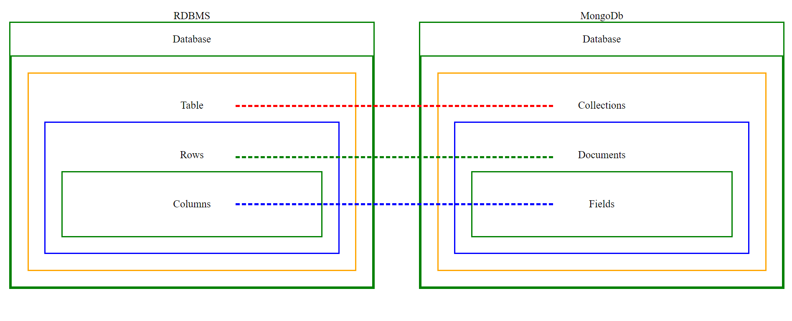

`5-0:` [Introduction](#5-0-introduction)

`5-1-A:` [Install MongoDB compass and No SQL Booster Windows](#5-1-a-install-mongodb-compass-and-no-sql-booster-windows)

`5-1-B:` [Install MongoDB compass and No SQL Booster Max Linux](#5-1-b-install-mongodb-compass-and-no-sql-booster-mac-linux)

`5-2:` [Insert, InsertOne, find, findOne, field, filtering, project](#5-2-insert-insertone-find-findone-field-filtering-project)

`Special` [`MongoDb Operators`](#mongodb-operators)

`5-3:` [$eq, $neq, $gt, $gte, $lte](#5-3-eq-neq-gt-gte-lte)

`5-4:` [$in, $nin, implicit and condition](#5-4-in-nin-implicit-and-condition)

`5-5:` [$and, $or, implicit vs explicit](#5-5-and-or-implicit-vs-explicit)

`5-6:` [$exists, $type, $size](#5-6-exists-type-size)

`5-7:` [$all, $elemMatch](#5-7-all-elemmatch)

`5-8:` [$set, $addToSet, $push](#5-8-set-addtoset-push)

`5-9:` [$unset, $pop, $pull, $pullAll](#5-9-unset-pop-pull-pullall)

`5-10:` [ More about $set, how to explore documentation](#5-10-more-about-set-how-to-explore-documentation)

`5-11:` [delete documents, drop collection and how to explore by yoursef](#5-11-delete-documents-drop-collection-and-how-to-explore-by-yoursef)

`5-12:` [Practice task-1](#5-12-practice-task-1)

`5-13:` [Database Command List](#5-13-database-command-list)

`5-14:` [Mongodb Shell Setup](#5-14-mongodb-shell-setup)

## 5-0 Introduction

#### What we are going to learn ?

- Mongodb basic query
- Powerful Aggregation Framework
- Indexing for faster queries
- Express.js and it's core concept
- Mongoose Fundamentals
- Crud operation using Express, Mongoose and Typescript
- Assignment 2

#### What is `Mongodb`

- Mongodb is a NoSql database which helps us to store data in a JSON like format
- NoSql database break form traditional relational model
- Ideal for managing vast data.
- Mongodb stands out for its
  - scalibility
  - flxibility
  - performance
- Users include google, facebook, eBay etc.
- Big company use mongdb for their micro services

#### Why should we use MongoDb

- Scalable high-performance and open source.
- Document-oriented Database
- Cost-Effective solutions.
- Rich Ecosystem of Tools, Documentation and Community.
- In Traditional database you must follow schema
- But in Mongodb you can have felxibility
- You can put structure data in mongodb and if you wish you can put unstructured data in mongodb

<table>
    <tr>
        <th>Feature</th>
        <th>Mongodb</th>
        <th>Traditional Database</th>
    </tr>
    <tr>
        <td>Data Model</td>
        <td>Document-oriented</td>
        <td>Relational</td>
    </tr>
    <tr>
        <td>Schema</td>
        <td>Flexible</td>
        <td>Rigid</td>
    </td>
    <tr>
       <td>Scalability</td>
        <td>Horizontal and vertical</td>
        <td>Vertical</td>
    </tr>
    <tr>
     <td>Performance</td>
        <td>Optimized for unstructured or semi-structured data</td>
        <td>Optimized for sturctured quries</td>
    </tr>
    
</table>

---

<div>
    
</div>

---

- In simple terms
<table>
    <tr>
        <th>RDBMS</th>
        <th></th>
        <th>MongoDB</th>
    </tr>
    <tr>
        <td>Database</td>
        <td>>-- are called in mongodb -></td>
        <td>Database</td>
    </tr>
    <tr>
        <td>Tables</td>
         <td>>-- are called in mongodb -></td>
        <td>Collectins</td>
    </tr>
     <tr>
        <td>Rows</td>
         <td>>-- are called in mongodb -></td>
        <td>Documents</td>
    </tr>
    <tr>
        <td>Columns</td>
         <td>>-- are called in mongodb -></td>
        <td>Fields</td>
    </tr>
</table>

---

### Extra features of MongoDb

- Json-like Document (BSON)
- Indexing
- Aggregation Framework
- Security Features
- Free Atlas Database
- Mongodb Compass (GUI-> graphical user interface)

### Where Mongodb will be a good choice

- E-commerce applications
- Social media applications
- Gamming applications
- Web applications
- Mobile applicatins
- Real-time applications

## 5-1-A Install MongoDB compass and No SQL Booster Windows

- Install Mongodb shell
- go to c --> Program Files --> Mongodb --> Server --> 7.0 --> bin

- copy the path -- C:\Program Files\MongoDB\Server\7.0\bin

- go to serach box

- write "edit environment variable"

- dobule click on "path"

- click new

- paste the path (C:\Program Files\MongoDB\Server\7.0\bin)

- `check` version of mongodb shell version

- `mongod` --version

- `starting command`
  - mongosh
  - Write command as usuas on your terminal and use
  - You will not get suggestions here

## 5-1-B Install MongoDB compass and No SQL Booster Mac Linux

- Only for mac users

## 5-2 insert insertOne find findOne field filtering project

#### <u> Difference between </u> db.getCollection('test') and db.test

<u>For Example: </u>

- db.getCollection('test').find()
  <br> or <br>
- db.test.find()

both `db.getCollection('test')` and `db.test.find()` can be used for `CRUD` operation but

- `db.getCollection('test')` can used in `Dynamic Collection Names` when the collection name is stored in a variable or needs to be constructed dynamically.

  - অর্থাৎ daynamic query এর ক্ষেত্রে ব্যাবহৃত হবে

```
let collectionName = "test";
db.getCollection(collectionName).find();
```

- `db.test.find():` is for `Static Collection Names` Use db.test when the collection name is known and fixed at the time of writing the query.

```
db.test.find();
```

- এক্ষেত্রে collection name আগে থেকে জানা অর্থৎ fixed/static, কোন dynamic query এর ক্ষেত্রে ব্যবহৃত হবেনা ।

- [5-2 insert](#5-2-insert)
- [5-2 insertOne](#5-2-insertone)
- [5-2 find](#5-2-find)
- [5-2 findOne](#5-2-findone)
- [5-2 field filtering](#5-2-field-filtering)
- [5-2 project ](#5-2-project)

#### 5-2 insert

- shell command
  - type --> use databaseName
  - type --> db.collectionName.insertOne()
  - type --> db.collectionName.insertMany()

```
    db.user.insertOne({name:"user one"})
```

- in the above code db --> indicates which database you are using
- db.user ---> `user` is the collection under database
- db.user.insertMany --> is the

`insertMany` <br>

- Aray of object parameter হিসাবে দিতে হবে

#### 5-2 insertOne

#### 5-2 find

`db.practice.find({age:17})`

- এর মানে হল db-->practice Collection --> document --> field
- practice collection এর ভিতরে document {} --> একটা field হল ‍`age`
- অর্থাৎ collection এর সকল field খুজবে এবং যেসব document {} এ age নামক field পাবে সেই সব document কে output দেখাবে ।
- match হওয়া সকল document দেখাবে

#### 5-2 findOne

`db.practice.findOne({age:17})`

- How MongoDB Selects the Document

  - Natural Order: MongoDB typically returns documents in the natural order, which is the order in which they were inserted into the collection. However, this order can change due to updates, deletions, or other operations that may affect the physical storage of documents.

  - Arbitrary Selection: If there are multiple documents that match the query criteria, and no sort order is specified, MongoDB may return any one of these documents. This means the result can be somewhat arbitrary when using findOne.

#### 5-2 field filtering

- কি কি field filter out করে নিয়ে আসবা ।

- যদি document এর সব data দরকার না হয় শুধু মাত্র কিছু field এর data দরকার হয় তাহলে আমরা field filtering করতে পারি

```
db.practice.find({gender:"Male"}, {name:1, gender:1, age:1})
```

- এখানে find এর ভিতরে second parameter হিসাবে field filtering দেয়া হয়েছে
- এই query দ্বারা শুধুমাত্র name, gender, age এর data আসবে অন্য field এর data আসবেনা ।

```
{
	"_id" : ObjectId("6406ad63fc13ae5a40000066"),
	"name" : {
		"firstName" : "Otto",
		"lastName" : "Mirfin"
	},
	"gender" : "Male",
	"age" : 12
},

- আবার field filtering এ 1 এর জায়গায় 0 দিলে সেই গুলো বাদে অন্য গুলো আসবে ।

```

```
db.practice.find({gender:"Male"}, {name:0, gender:0, age:0})
```

- উপরের query তে সেই সব document আসবে যাদের gender:"Male" এবং সেখানে name, gender, age এই ৩ field বাদে অন্য সকল field এর value থাকবে ।

#### 5-2 project

- এই field filtering আমরা chaining করে করতে পারি `project` এর মধ্যমে

```
db.practice.find({gender:"Male"}).project({name:1, gender:1})
```

N.b - `project` শুধু মাত্র `find` এর জন্য ব্যাবহার করা যায় `findOne` এর ক্ষেত্রে `project` support করেনা । সেক্ষেত্রে আগের নিয়মে second parameter দিয়ে ব্যাবহার করতে হবে

---

---

## Mongodb Operators

- <a target="_blank" href="https://www.mongodb.com/docs/manual/reference/operator/">Mongodb operators documents Link</a>
<ul>
   <li>
       Query and Projection Operators
       <ul>
         <li> goto Sidebar --> Reference --> Operators -->Query and Projection Operators </li>        
         <ul>
            <li>Comparison Operators --> $eq, $gt, $gte, $in, $lt, $lte, $ne, $nin </li>
            <li>Logical query operators --> $and, $not, $nor, $or, </li>
            <li>Element Query Operators --> $exists, $type, </li>
            <li>Evaluation Query Operators --> $expr, $jsonSchema, $mod, $regex, $text, $where</li>
            <li>Geospatial Query Operators --> $geoWithin, $center, $centerSphere, $box, $polygon, $geoIntersects, $geometry, $near, $minDistance, $maxDistance, $nearSphere, $geoWithinSphere</li>
            <li>Array Query Operators --> $all, $elemMatch(query), $size </li>
            <li>Bitwise Query Operators --> $bitsAllClear, $bitsAllSet, $bitsanyClear, $bitsAnySet </li>
            <li>Projection  Operators --> $(projection), $elemMatch(projection), $slice(projection), </li>
            <li>Miscellaneous Query Operators --> $comment, $rand, $natural </li>
         </ul>
       </ul>
   </li>
   <li>Update Operators</li>
   <li>Aggregation Stages</li>
   <li>Aggregation Operators</li>
</ul>
- Operators Resources
  -Query and Projection Operators
  - Goto Sidebar --> Reference --> Operators
    - Operators
- Update Operators

#### `Comparison Oeprator below 5-3 and 5-4`

### Thumb rule`: যখন কোন operator আনব তখন দুই পাসে second bracket দিয়ে দিব

## 5-3 $eq $ne $gt $gte $lte

- `$eq = equal`
- `$ne = not equal`
- `$gt = greater than`
- `$gte = greater than or equal to`
- `$lt = less than`
- `$lte = less than or equal to`

### $eq === equal to

- $eq has following form

```
{<field>: {$eq:<value>}}
```

- Example

```
db.practice.find({gender:{$eq:"Male"}})
// or
db.practice.find({age:{$eq:12}})
```

- প্রথমটায় যাদের gender শুধু মাত্র male তাদের কে খুজে নিয়ে আসবে
- age equal to 12

```
db.practice.find({age:{$gt:12}})  // greater than 12
db.practice.find({age:{$gte:12}}) // greater than or equal to 12
db.practice.find({age:{$lt:12}}) // less than 12
db.practice.find({age:{$lte:12}}) // less than or equal to 12

```

### $ne == not euqul

```
db.practice.find({age:{$ne:12}}).sort({age:-1}) // বড় থেকে ছো্ট
db.practice.find({age:{$ne:12}}).sort({age:1}) // ছোট থেকে বড়
```

- সকল collection search করবে এবং যেসব document এর ভিতরে age নামক field আছে তাদের যাদের যাদের value 12 নয় তাদেরকে দেখাবে ।

- sort এর মাধ্যমে data sort করা যায়, এখানে বয়স এর উপর ভিত্তি করে sort করা হয়েছে ।

## 5-4 $in, $nin, implicit and condition

- $in operator selects the `documents` where the value of a field equals any value in the specified array.

```
{ field: { $in: [<value1>, <value2>, ... <valueN> ] } }
```

- $in এর ভিতরে field value array আকারে দেয়া হয়,
- field এর যেসব value গুলো মিলবে সেসব document কে query করে নিয়ে আসবে ।

```
db.practice.find({age:{$in:[12,34,40,30]}}).project({name:1, age:1})
```

- Practice collection [{}, {}, {}], যেসব docment {} আছে তাদের ভিতরে age field এর ভিতর যেসব value 12,34,40,30 এই 4 টি সংখার যেকোন একটির সাথে মিলে যাবে সেই সব document গুলোকে show করবে ।
- অর্থাৎ যে document এর সাথে মিলবে সেই document কেই দিবে

### implicit and condition

#### implicit and

- `implicit (অন্তর্নিহিত) `: it is not explicitly defined by the system but happen automatically by the system is called implicit.
- অর্থাৎ এমন একটা বিহেভিয়র যা mongodb এর নিজস্ব সিস্টিম দ্বারা সয়ংক্রিয় ভাবে ঘটে । অর্তাৎ default behaviour.

- `implicit and` comma এর মাধ্যমে লেখা হয় for example, আমরা ১৮ থেকে ৩০ বছর বয়স যাদের document গুলো দেখতে চাই ।

```
db.practice.find({age:{$gt:18, $lt:30}}, {name:1,age:1}).sort({age:1})
```

- উপরে আমরা query `{age:{$gt:18, $lt:30}}` লিখছি, এই কমা দিয়ে ‍ সেপারেট করা কেই আমরা `inplicit and` বলতেছি । কেননা কমা হল এখানে একটা default mongodb behaviour.
- কমা দিয়ে `and` করতে পারতেছি

#### `implicity and` in `filed` query

```


db.practice.find({gender:"Male",age:18}) // ----১

db.practice.find({gender:"Male",age:{$gt:18}}) // ---- ২

db.practice.find({gender:"Male",age:{$gt:18, $lt:30}}) // ----৩

db.practice.find({gender:"Female",age:{$gt:18, $lt:30}}) // ----৪

```

১. সেই সব document যাদের gender = Male এবং বয়স ১৮

২. সেই সব document যাদের gender = Male এবং বয়স ১৮ এর বেশি

৩. সেই সব document যাদের gender = Male এবং বয়স ১৮ এর বেশি এবং ৩০ এর কম

৪. সেই সব document যাদের gender = `Female` এবং বয়স ১৮ এর বেশি এবং ৩০ এর কম

- একটা query example

```
// 1
db.practice.find(
    {
        gender:"Male",
        age: { $gt: 18, $lt: 30 }
    }, { name: 1, age: 1, gender: 1 }
)
    .sort({ age: 1 })
```

```
/// 2
db.practice.find(
    {
        gender: { $in: ["Male", "Female"] },
        age: { $gt: 18, $lt: 30 }
    }, { name: 1, age: 1, gender: 1 }
)
    .sort({ age: 1 })
```

---

1. {gender:"Male",age:{$gt:18, $lt:30}} == gender:Male ,বয়স ১৮ থেকে ৩০ <br>
   a. find এর ২য় parameter {name:1,age:1, gender:1} == query তে name,age, gender দেখাতে হবে <br>
   b. sort, age দিয়ে করা হয়েছে asscending order (ছোট থেকে বড় )

2. {gender:{$in:["Male", "Female"]},age:{$gt:18, $lt:30}} == gender:Male এবং Female ,বয়স ১৮ থেকে ৩০ <br>

```
db.practice.find(
    {
        gender:"Male",                          // gender Male হতে হবে
        age: {$nin:[18,20,22,24,26,28] },       // age 18,20,22,24,26,28 বাদে অন্য হতে হবে
        interests:{$in:['Cooking', "Gaming"]}   // interest Cooking অথবা Gaming যেকোন একটা হতে হবে
    },
     { name: 1, age: 1, gender: 1,interests:1 }  // find এর ২য় parameter -- কি কি দেখাবে
)
    .sort({ age: 1 })                            // age, assencding order এ sort করবে
```

## 5-5 $and $or implicit-vs-explicit

## 5-6 $exists, $type, $size

## 5-7 $all $elemMatch

## 5-8 $set $addToSet $push

## 5-9 $unset $pop $pull $pullall

## 5-10 More about $set, how to explore documentation

## 5-11 delete documents, drop collection and how to explore by yoursef

## 5-12 Practice task-1

## 5-13 Database Command List

<table>
    <tr>
        <th>
            Purpose 
        </th>
        <th>
            Command
        </th>
    </tr>
    <tr>
        <td>
            Create Database
        </td>
        <td>
            use databaseName (use practice)
        </td>
    </tr>
    <tr>
        <td>
            Show all Database
        </td>
        <td>
            show database
        </td>
    </tr>
    <tr>
        <td>Create Collection</td>
        <td> db.createCollection("collection name") </td>
    </tr>
    <tr>
        <td>insert One data in collection</td>
        <td>
        db.getCollection("collectionName").insertOne({name:"Next Level"})
        </td>
    </tr>
    <tr>
        <td>Find a collection</td>
        <td>
            db.getCollection("collectionName").find()
        </td>
    </tr>
    <tr>
        <td>
        </td>
        <td></td>
    </tr>
</table>

## # 5-14 Mongodb Shell Setup

- Install Mongodb shell
- go to c --> Program Files --> Mongodb --> Server --> 7.0 --> bin

- copy the path -- C:\Program Files\MongoDB\Server\7.0\bin

- go to serach box

- write "edit environment variable"

- dobule click on "path"

- click new

- paste the path (C:\Program Files\MongoDB\Server\7.0\bin)

- `check` version of mongodb shell version

- `mongod` --version

- `starting command`
  - mongosh
  - Write command as usuas on your terminal and use
  - You will not get suggestions here
