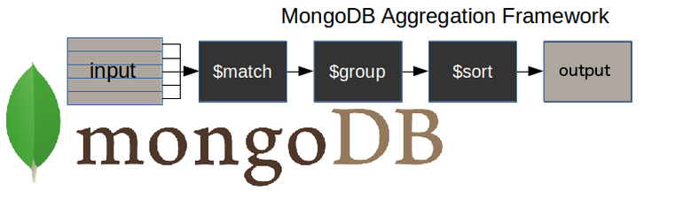

`6-0:` [Intro to aggregation](#6-0-intro-to-aggregation)

`6-1:` [$match, $project aggregation peoject](#6-1-match-project-aggregation-peoject)

`6-2:` [$addFields, $out, $merge aggregation stage](#6-2-addfields-out-merge-aggregation-stage)

`6-3:` [$group, $sum, $push agrregation stage](#6-3-group-sum-push-agrregation-stage)

`6-4:` [explore more about $group and $project](#6-4-explore-more-about-group-and-project)

`6-5:` [explore $group with $unwind agrregation stage](#6-5-explore-group-with-unwind-agrregation-stage)

`6-6:` [$bucket,$sort, and $limit aggregation stage](#6-6-bucket-sort-and-limit-aggregation-stage)

`6-7:` [$facet, mutliple pipeline aggregation stage](#6-7-facet-mutliple-pipeline-aggregation-stage)

`6-8:` [$lookup stage, embedding vs referencing.mp4](#6-8-lookup-stage-embedding-vs-referencing-mp4)

`6-9:` [$what is indexing, COLLSCAN vs IXSCAN](#6-9-what-is-indexing-collscan-vs-ixscan)

`6-10:` [Explore compound index and text index](#6-10-explore-compound-index-and-text-index)

`6-11:` [Practice Task-2](#6-11-practice-task-2)

`6-12:` [Resources Links](#6-12-resources-links)

# `6-0` Intro to aggregation

#### # What is aggregation?

`db.collectionName.aggregate(pipeline, options)`

- Aggregation is a way of processing a large number of documents in a collection by means of passing them through `different stages`

- The stages make up what is known as a pipeline

- The `stages` in a pipeline can filter, sort, group, reshape, and modify documents that pass through the pipeline

<div>
    
</div>

- উপরের diagram যে একমাত্র মেথডনা আরো মেথড আছে
  - প্রবলেম, requirement এর উপর ভিত্তি করে মেথড ভিন্ন হতে পারে
  - This is a common flow

#### `$match` Stage - filters those documents we need to work with, those that fit our needs (simlilar to `find`)

#### `$group` Stage - Does the aggregation job

#### `$sort` Stage - sorts the resulting documents the way we require (assending or descending)

- The input of the pipeline can be a single collection, where others can be merged later down the pipeline.

#### `Syntax`

```
db.collection.aggregate(
    [
        {},                               // state-1 pipeline
        {},                               // state-2 pipeline
        {}                                // state-3 pipeline
    ]
)
```

# `6-1` $match, $project aggregation peoject

- general aggregation rule is
  `db.collectionName.aggregate(pipeline, options)`
- `find()` ---> is changed to `$match` in aggregation

```
db.practice.aggregate(
    [
       { $match: {age:{$lt:30, $gt:18}}}
    ])
```

- age less than 30 and greater than 18 is showed where `$match` act as a `find`

- The above code is smililar to below code

```
db.practice.find(
    {age:{$lt:30, $gt:18}}
    )
```

- `aggregation` works step by step

  - `$match` is considered as first step

  ```
  db.practice.aggregate(
    [
        // stage 1
        {$match: {gender:"Male"}}
    ]
  )
  ```

- using multiple condition in `$match` -- inplicit condition

```
db.practice.aggregate(
    [
        // stage 1
        { $match: { gender: "Male", age:{$lt:30}} }
    ]
)
```

- `$match` এর ভিতর কমা দিয়ে দিয়ে লিখতে হবে ।

#### `$project` stage

```
// case --1
db.practice.aggregate(
    [
       {$match: { gender: "Male", age:{$lt:30}} },     // stage 1
       {$project: {name:1, gender:1, age:1}}            // stage 2

    ]
)
```

- এখানে ডাটা এক স্টেজ থেকে আর এক স্টেজে পাস হয় অরথাৎ আগের স্টিজ এর ডাটার উপর নির্ভর করবে পরের স্টেজের ডাটা

- এখন আমরা উপরের ⬆️ কোডে `$project` কে আগে লিখি এবং `$match` কে পরে লিখি তাহলে একই result show করবে

```
// case --2
db.practice.aggregate(
    [
        { $project: { name: 1, gender: 1, age: 1 } },
        { $match: { gender: "Male", age: { $lt: 30 } } },
    ]
)
```

- `কিন্তু` যদি `$project` stage এ আমরা ⬇️ ‍ `age` field টাকে অমিট করে দেই তাহলে কোন ডাটাই শো করবেনা

```
// case -- 3
db.practice.aggregate(
    [
        { $project: { name: 1, gender: 1 } },                    // ‍stage 1
        { $match: { gender: "Male", age: { $lt: 30 } } },        // stage 2
    ]
)
```

- উপরের কোডটি ⬆️ কোন ডাটাই শো করবেনা ০ রেসাল্ট দেখাবে ।

  - কারন প্রথম স্টেজে `$project` করার কারনে সকল document থেকে শুধুমাত্র `name` আর `gender` field project করতেছে

    - অর্থাৎ সকল document কে নিয়ে এসেছে এবং সেই সব document এর `name` আর `gender` field filter করে নিয়ে এসেছে অন্য ফিল্ড সমূহ সে আনে নাই এবং এই ডাটা সে পরের স্টেজে পাঠিয়ে দিচ্ছে ।

  - প্রথম স্টেজ এর ডাটাই দ্বিতীয় স্টেজে আসে তাই যখন `$match` করা হয় তখন সে `age` field কে খুজে পায়না তাই মে `0` result show করে । যেহেতু এখানে `implicit and` ব্যবহৃত হয়েছে তাই তকে দুইটা কন্ডিশন মিলাতে হবে । সে কোন `age` খুজে পাচ্ছেনা ।

  - কিন্তু case --2 তে show করবে কারন সেখানে `age` field কে project করা হয়েছে এবং সেই ডাটা যখন পরের স্টেজে এসেছে তাই সে ডাটা দেখচ্ছিল ।

  - এজন্য `$project` সবার শেষে ব্যাবহার করি আমরা, সবরকম ফিল্টার শেষে আমরা যাদের দরকার তাদের `$project` করে দিব ⬇️

```
// case --1
db.practice.aggregate(
    [
       {$match: { gender: "Male", age:{$lt:30}} },     // stage 1
       {$project: {name:1, gender:1, age:1}}            // stage 2

    ]
)
```

- এখানে stage -- 1 এ `$match` (simlilar to find) এর মাধ্যমে document গুলোকে নিয়ে আসা হয়েছে, যেসব document এমেছে তাদের মধ্যে সকল field আছে

- stage -- 2 এ `$project` এর মাধ্যমে document থেকে field filtering অর্থাৎ যেসকল ফিল্ড আমার দরকার তাদের রাখা হয়েছে এবং বাকিদের বাদ দেয়া হয়েছে ।

- একই oparator একের বেশিবার ব্যাবহার করা যাবে কিন্তু target হব যত স্টেপ কম হবে তত দ্রুত কোয়েরি হবে ।

```
 // not recomended
db.practice.aggregate(
    [
         { $match: { gender: "Male" } },
         {$match:{age:{$lt:30}}},
        { $project: { name: 1, gender: 1 } },

    ]
)
```

# `6-2` $addFields, $out, $merge aggregation stage

### `$addFields`: it is possible that you need to make some changes to your output in the way of new fields.

- অর্থাৎ আমরা নতুন field যোগ করতে পারব ।

```
db.practice.aggregate(
    [
        { $match: { gender: "Male", age: { $lt: 30, $gt:18 } } },
        {$addFields: {isMarriageReady:"Yes marrige ready", isMale:true}},
        { $project: { name: 1, gender: 1, isMarriageReady:1, isMale:1 } },
    ]
)
```

- ⬆️ উপরে থেকে আমরা দেখতে পাচ্ছি `$addFields` এর মাধ্যমে আমরা নতুন দুইটা field যোগ করা হয়েছে `isMarriageReady`, `isMale` , এগুলো মূল database, এ ছিলনা যা পরে যোগ করা হয়েছে
- `$addField` original collection কে মডিফাই করেনা

### `$out`

- This is an unusal types of statge because it allows you to carry the result of your aggregation over into a new collection, or into an existing one after droping it, or even adding them to the existing documents.

- `$out must be the last stage in the pipeline`

- অর্থৎ agrregation এর অন্যান্য process complete করার পর যে ডাটা আসবে সেই ডাটা কে ডাটাবেস এর অন্য একটা কালেকশন এ সেভ করবে ।

```
db.users.aggregate(
    [
        { $match: { gender: "Male", age: { $lt: 30, $gt:18 } } },
        {$addFields: {isMarriageReady:"Yes marrige ready", isMale:true}},
        { $project: { name: 1, gender: 1, isMarriageReady:1, isMale:true, ifFemale:1 } },
        {$out:"marrige-ready-guys"},
    ]
)
```

- ⬆️ উপরের কোড থেকে `$out` এর মাধ্যমে একই ডাটাবেস এ নতুন একটা কালেকশন তৈরি হবে যার নাম হবে `marrige-ready-guys` এবং এই কালেকশনে `$project` Stage এর পরে যেসব ডাটা থাকবে শুধু তদের নিয়ে গঠিত হবে
- অর্থৎ

- ⬇️ smaple data (array of objects)

- ⬆️
  - `$match` প্রথমে `user` database থেকে data collect করবে
  - `$addFields` নতুন field add করা হয়েছে
  - `$project` দ্বারা প্রয়োজনীয় ডাটা প্রজেক্ট করা হয়েছে
  - `$out` দ্বারা একই ডাটাবেস নতুন একটা `marriage-ready-guys` কালেকশন তৈরি করবে এবং `project` কৃত ডাটা সমূহ এই কালেকশনে সেভ করবে । ⬇️

```
[

{---},
{
	"_id" : ObjectId("6406ad64fc13ae5a4000006f"),
	"name" : {
		"firstName" : "Rudolf",
		"lastName" : "Seres"
	},
	"gender" : "Male",
	"isMarriageReady" : "Yes marrige ready",
	"isMale" : true
},
{---},

]
```

### `$merge` --> existing document এর সাথে merge করতে চাইলে।

- আগের document রাখবে নতুন document ও রাখবে ।

```
db.users.aggregate(
    [
        { $match: { gender: "Male", age: { $lt: 30, $gt:18 } } },
        {$addFields: {isMarriageReady:"Yes marrige ready", isMale:true}},
        {$merge:"users"},
    ]
)
```

- `$merge:"collectionName"`

# `6-3` $group, $sum, $push agrregation stage

### `$group`:

- The `group` stage separates documents into groups according to a `group key`. The output is one document for each unique group key

- A group key is often a `field`, or group of `fields`. The group key can also be the result of an expression. Use the \_id field in the $group pipeline stage to set the group key.

```
db.practice.aggregate(
    [
       // Stage -1
       {$group:{
           "_id":"$gender",
       }}
    ]
)

```

# `6-4` explore more about $group and $project

# `6-5` explore $group with $unwind agrregation stage

# `6-6` $bucket, $sort, and $limit aggregation stage

# `6-7` $facet, mutliple pipeline aggregation stage

# `6-8` $lookup stage, embedding vs referencing mp4

# `6-9` $what is indexing, COLLSCAN vs IXSCAN

# `6-10` Explore compound index and text index

# `6-11` Practice Task-2

# `6-12` Resources Links

- <a target="_blank" href="https://studio3t.com/knowledge-base/articles/mongodb-aggregation-framework/">The Beginner’s Guide to MongoDB Aggregation (With Exercise)</a>
